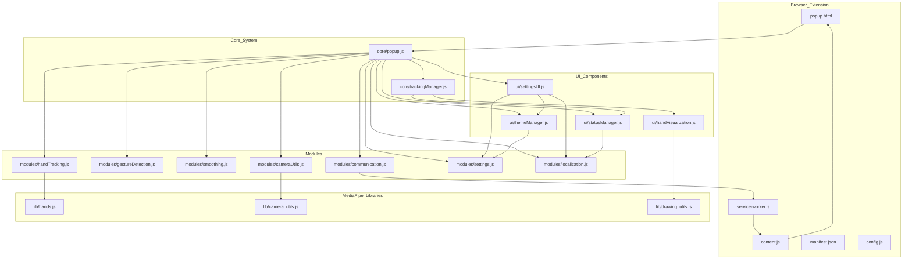
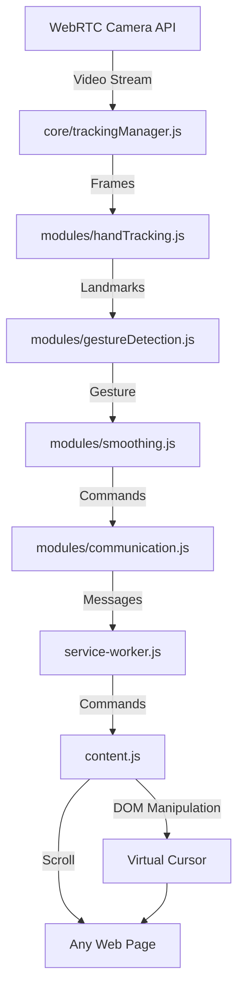
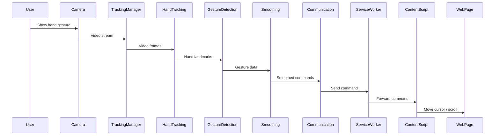
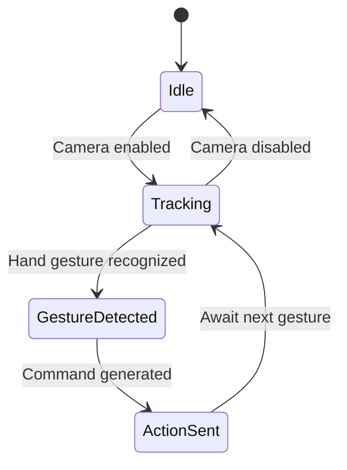

# Wavi Browser Extension – Key Architecture Diagrams

Below are the most relevant diagrams for your bachelor paper. You can copy the Mermaid code blocks directly into your thesis or use them as a basis for graphical tools.

---

## 1. Component Diagram

---

## 2. Data Flow Diagram

---

## 3. Sequence Diagram: Hand Gesture to Cursor Move

---

## 4. State Diagram: Extension Operation

---

These diagrams are suitable for academic papers and clearly show the architecture, data flow, dynamic behavior, and states of your browser extension.
