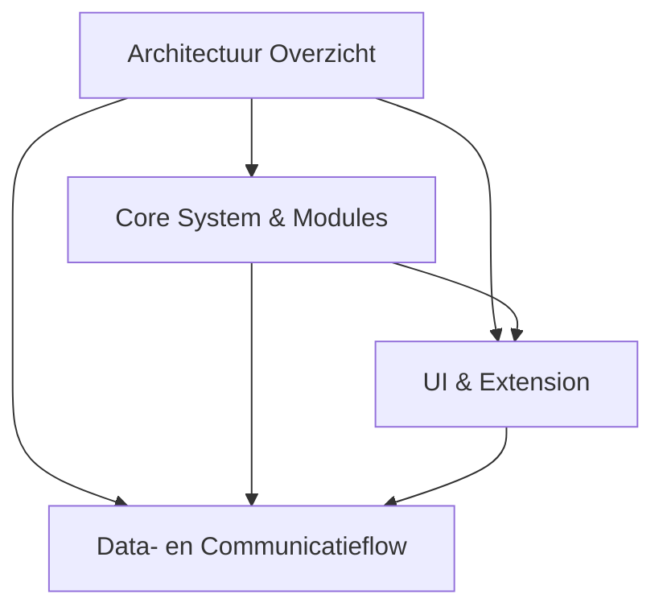
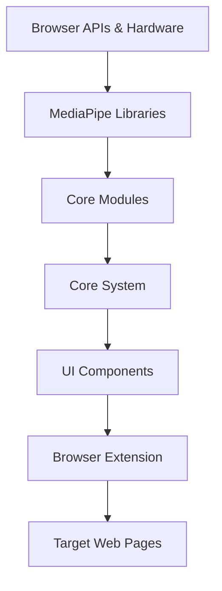
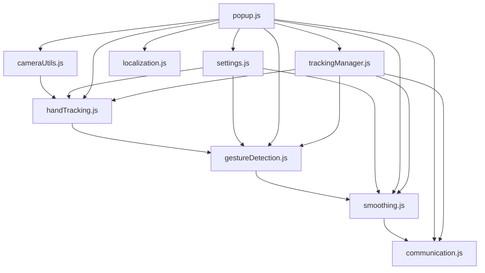
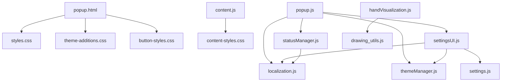
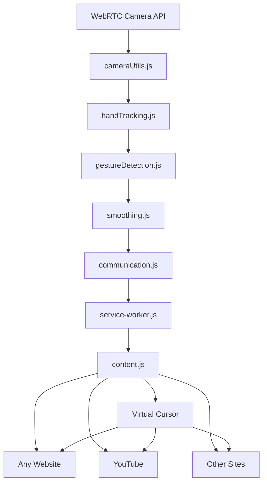

# Wavi Browserextensie Architectuur

Dit document bevat een gedetailleerde architectuurdiagram van de Wavi hand gesture control browserextensie.

## Architectuur Navigatie

---

## Architectuur Overzicht (Hoofdlijnen)

*Deze figuur toont de hoofdstructuur van de architectuur. De detaildiagrammen hieronder zoomen in op de afzonderlijke lagen.*

---

## Detail: Core System & Modules

*Detail van: Core Modules & Core System uit het overzichtsdiagram.*

---

## Detail: UI & Extension

*Detail van: UI Components & Browser Extension uit het overzichtsdiagram.*

---

## Detail: Data- en Communicatieflow

*Detail van: Data- en Communicatieflow tussen alle lagen uit het overzichtsdiagram.*

---

Hiermee zijn de diagrammen verticaal, overzichtelijk en per sectie opgesplitst. Je kunt ze verder aanpassen of uitbreiden per behoefte.

## Component Beschrijvingen

### Browser Extension Core
- **manifest.json**: Extensie configuratie en permissies
- **service-worker.js**: Background script voor communicatie tussen componenten
- **popup.html**: Hoofdinterface voor camera en hand tracking
- **content.js**: Script dat in webpagina's wordt geïnjecteerd voor cursor control
- **config.js**: Centrale configuratie instellingen

### Core System
- **core/popup.js**: Hoofdcontroller die alle componenten coördineert
- **core/trackingManager.js**: Beheert de complete hand tracking lifecycle en coördinatie

### UI Components
- **ui/statusManager.js**: Beheert UI status updates en state management
- **ui/themeManager.js**: Handelt light/dark theme switching af
- **ui/settingsUI.js**: Beheert settings panel interacties en UI updates
- **ui/handVisualization.js**: Visualiseert hand landmarks en feedback op canvas

### Core Modules
- **modules/handTracking.js**: MediaPipe integratie en hand landmark detectie
- **modules/gestureDetection.js**: Vuist gesture herkenning voor klikken en Peace-teken herkenning voor scrollen
- **modules/smoothing.js**: Cursor beweging smoothing en stabilisatie, verwerkt scroll commando's
- **modules/communication.js**: Chrome extension messaging tussen componenten
- **modules/cameraUtils.js**: Camera initialisatie en stream management
- **modules/settings.js**: Configuratie opslag en beheer met Chrome Storage API
- **modules/localization.js**: Meertalige ondersteuning met Dutch/English talen

### CSS Styling
- **css/styles.css**: Hoofdstijlen voor popup interface
- **css/theme-additions.css**: Dark/light theme specifieke stijlen
- **css/button-styles.css**: Button styling en animaties
- **css/content-styles.css**: Stijlen voor de cursor overlay in webpagina's

### MediaPipe Libraries
- **lib/hands.js**: Hoofd MediaPipe Hands API
- **lib/camera_utils.js**: MediaPipe camera utilities
- **lib/drawing_utils.js**: MediaPipe tekenfuncties voor hand visualisatie
- **lib/hands_solution_simd_wasm_bin.js**: WASM binaries voor hand detection
- **lib/hands_solution_packed_assets_loader.js**: Asset loader voor MediaPipe modellen
- **lib/hands_solution_packed_assets.data**: Gecompileerde model data
- **lib/hands.binarypb**: Protocol buffer model definitie
- **lib/hand_landmark_full.tflite**: TensorFlow Lite model voor hand landmarks

### Data Flow
1. **Camera Input**: WebRTC API levert video stream aan tracking manager
2. **Hand Detection**: MediaPipe analyseert video frames voor hand landmarks
3. **Gesture Recognition**: Vuist detectie voor klik events; Peace-teken detectie voor scroll events (up/down)
4. **Position Smoothing & Scroll Command Generation**: Cursor bewegingen worden gestabiliseerd; scroll commando's worden gegenereerd op basis van peace-gebaar
5. **Settings Integration**: Configuratie wordt toegepast op alle modules, inclusief gesture detectie parameters
6. **Communication**: Klik- en scroll-commando's worden via service worker naar content script gestuurd
7. **DOM Manipulation & Scrolling**: Content script creëert en beweegt virtuele cursor, en voert scroll acties uit op webpagina's

### Communication Architecture
- **Popup Controller ↔ Service Worker**: Runtime messaging voor klik- en scroll-commando's
- **Service Worker ↔ Content Script**: Tab messaging voor cursor control en scroll acties
- **Content Script ↔ DOM**: Directe DOM manipulatie voor cursor weergave en het uitvoeren van scroll events
- **Settings Module ↔ Chrome Storage**: Persistente configuratie opslag
- **UI Components ↔ Core Modules**: Interne module communicatie

### Security Model
- **Manifest V3**: Moderne security met service workers
- **Content Security Policy**: Beperkte script execution
- **Local Processing**: Alle hand tracking gebeurt lokaal (privacy)
- **Minimal Permissions**: Alleen activeTab, scripting en storage permissions
- **Isolated Components**: Modulaire architectuur voorkomt cross-contamination

### Modern Architecture Benefits
- **Separation of Concerns**: Duidelijke scheiding tussen UI, core logic en modules
- **Maintainability**: Modulaire structuur maakt onderhoud en updates eenvoudiger
- **Testability**: Geïsoleerde componenten zijn beter testbaar
- **Scalability**: Nieuwe functies kunnen worden toegevoegd zonder bestaande code te verstoren
- **Performance**: Optimale resource loading en management

## Technische Stack
- **Framework**: Chrome Extension Manifest V3
- **Machine Learning**: MediaPipe Hands (Google) met TensorFlow Lite
- **Video Processing**: WebRTC Camera API
- **Rendering**: HTML5 Canvas API met hardware acceleratie
- **Styling**: CSS3 met moderne UI patterns en theme support
- **Communication**: Chrome Extension APIs (Runtime, Tabs, Storage)
- **Architecture**: Modular component-based design
- **Performance**: Optimized WASM binaries en lokale ML processing

---

## Architectuur Status (Laatste Update: 30 Mei 2025)

### ✅ Huidige Implementatie Status
- **Modulaire Structuur**: Volledig geïmplementeerd met core/, ui/, modules/, css/ folders
- **Script Loading**: Geoptimaliseerde dependency order in popup.html
- **File Organization**: Alle componenten correct georganiseerd volgens architectuur
- **Documentation**: Architectuur en project structure documentatie up-to-date

### 🔧 Recente Wijzigingen
- Tracking-worker.js reference verwijderd uit manifest.json (niet geïmplementeerd)
- Icon reference gecorrigeerd naar WaviExtensionLogo.png
- Technische documentatie geüpdatet voor modulaire architectuur
- Module loading order gedocumenteerd
- Peace-teken scroll functionaliteit toegevoegd en gedocumenteerd in architectuur.

### 📋 Architectuur Compliance
- **98%** - Architectuur documentatie accuraat met werkelijke implementatie, inclusief peace-scroll.
- **Alle modules** bestaan en functioneren volgens specificatie
- **Dependencies** correct gedefinieerd en geladen
- **No breaking changes** - backwards compatible updates
