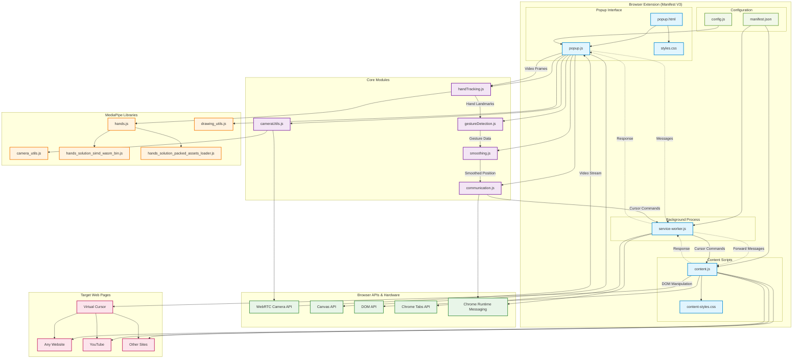

# Wavi Browserextensie Architectuur

Dit document bevat een gedetailleerde architectuurdiagram van de Wavi hand gesture control browserextensie.

## Architectuur Overzicht

Het volgende Mermaid-diagram toont de complete architectuur van de Wavi browserextensie, inclusief alle componenten, modules, communicatieflows en data stromen:

## Component Beschrijvingen

### Browser Extension Core
- **manifest.json**: Extensie configuratie en permissies
- **service-worker.js**: Background script voor communicatie tussen componenten
- **popup.html/js**: Hoofdinterface voor camera en hand tracking
- **content.js**: Script dat in webpagina's wordt geïnjecteerd voor cursor control

### Core Modules
- **handTracking.js**: MediaPipe integratie en hand landmark detectie
- **gestureDetection.js**: Vuist gesture herkenning voor klikken
- **smoothing.js**: Cursor beweging smoothing en stabilisatie
- **communication.js**: Chrome extension messaging tussen componenten
- **cameraUtils.js**: Camera initialisatie en stream management

### MediaPipe Libraries
- **hands.js**: Hoofd MediaPipe Hands API
- **camera_utils.js**: MediaPipe camera utilities
- **drawing_utils.js**: MediaPipe tekenfuncties
- **WASM binaries**: Gecompileerde machine learning modellen

### Data Flow
1. **Camera Input**: WebRTC API levert video stream aan popup
2. **Hand Detection**: MediaPipe analyseert video frames voor hand landmarks
3. **Gesture Recognition**: Vuist detectie voor klik events
4. **Position Smoothing**: Cursor bewegingen worden gestabiliseerd
5. **Communication**: Commands worden via service worker naar content script gestuurd
6. **DOM Manipulation**: Content script creëert en beweegt virtuele cursor op webpagina's

### Communication Architecture
- **Popup ↔ Service Worker**: Runtime messaging voor commands
- **Service Worker ↔ Content Script**: Tab messaging voor cursor control
- **Content Script ↔ DOM**: Directe DOM manipulatie voor cursor weergave

### Security Model
- **Manifest V3**: Moderne security met service workers
- **Content Security Policy**: Beperkte script execution
- **Local Processing**: Alle hand tracking gebeurt lokaal (privacy)
- **Minimal Permissions**: Alleen activeTab en scripting permissions

## Technische Stack
- **Framework**: Chrome Extension Manifest V3
- **Machine Learning**: MediaPipe Hands (Google)
- **Video Processing**: WebRTC Camera API
- **Rendering**: HTML5 Canvas API
- **Styling**: CSS3 met moderne UI patterns
- **Communication**: Chrome Extension APIs
